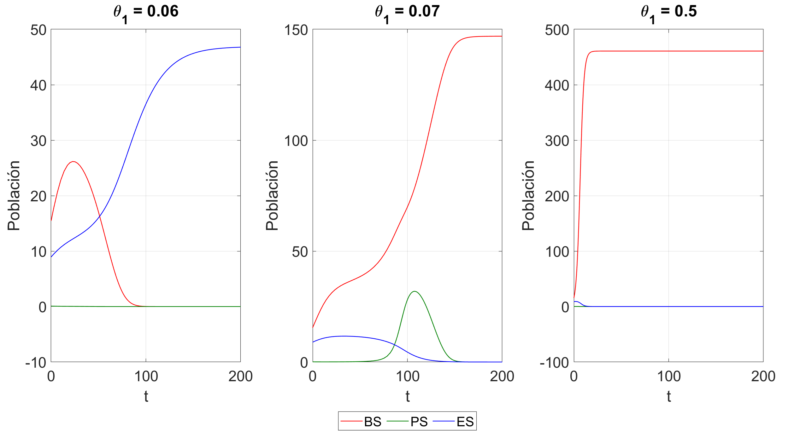

<header>

</header>

     

# Conservación e interacción dinámica de especies nativas y exóticas en una reserva ecológica

Repositorio de la memoria "Conservación e interacción dinámica de especies nativas y exóticas en una reserva ecológica", que incluye modelos matemáticos y simulaciones numéricas para estudiar la interacción y conservación de las especies.

---

## Problemática

En muchas reservas ecológicas, la introducción de especies exóticas puede alterar el equilibrio natural, afectando la supervivencia de especies nativas y la dinámica de los ecosistemas. La correcta gestión de estas especies requiere herramientas que permitan predecir cómo distintas estrategias de manejo afectan la coexistencia de especies.

---

## Origen del modelo y motivación del estudio

Este trabajo se basa en los resultados de *Acosta-Arreola et al. (2023)*, donde se proponen y analizan distintos modelos matemáticos para describir la interacción dinámica entre especies nativas y exóticas.  
En dicho estudio, el **modelo II-B** fue identificado como el que mejor representa la realidad observada en la reserva.  

Una de las conclusiones clave del paper es que, **sin intervención humana, las especies nativas tienden a extinguirse** debido a la competencia con la especie exótica.  

A partir de esta premisa, la presente memoria desarrolla y evalúa **seis estrategias de manejo** que combinan tala y replantación, con el objetivo de analizar su impacto sobre la conservación de las especies nativas y el control de la especie exótica.

---

## Objetivos
  
- Evaluar el efecto de distintas estrategias de manejo (replantación, tala) sobre la supervivencia de las especies.
- Analizar la dinámica poblacional de especies nativas y exóticas mediante modelos matemáticos.
- Desarrollar herramientas de simulación numérica en MATLAB para explorar distintos escenarios de conservación.

---

## Estrategias de manejo evaluadas

1. Tala constante del eucalipto.
2. Replantación constante del Tepozán.
3. Replantación constante del Palo Loco.
4. Replantación conjunta de ambas especies nativas.
5. Replantación conjunta de especies nativas + tala constante del eucalipto.
6. Replantación conjunta de especies nativas + tala periódica del eucalipto.

---

## Metodología

1. **Modelación Matemática**  
   Se empleó el modelo II-B como base, formulando un sistema de ecuaciones diferenciales no lineales para describir la dinámica de las tres especies.

2. **Análisis de Puntos Críticos y Estabilidad**  
   Se determinaron los puntos de equilibrio y su estabilidad según distintas condiciones y estrategias.

3. **Simulación Numérica en MATLAB**  
  Implementación de códigos para explorar la evolución poblacional bajo cada estrategia de manejo propuesta.

---

## Contenido del Repositorio

- **memoria/**  
  Contiene el PDF de la memoria completa y la presentación utilizada para la defensa.  

- **codigos_matlab/**  
  Contiene todos los códigos MATLAB organizados por estrategia de manejo:
  - `estrategia1/`: Tala constante del eucalipto.
  - `estrategia2/`: Replantación constante del Tepozán.
  - `estrategia3/`: Replantación constante del Palo Loco.
  - `estrategia4/`: Replantación conjunta de ambas especies nativas.
  - `estrategia5/`: Replantación conjunta de especies nativas + tala constante del eucalipto.
  - `estrategia6/`: Replantación conjunta de especies nativas + tala periódica del eucalipto.

- **imagenes/**  
  Carpeta con imágenes usadas en el README (logos, diagramas, resultados).

---

## Resultados principales

- Identificación de regiones de supervivencia para cada especie según estrategia de manejo.  
- Gráficos 2D de trayectorias de poblaciones bajo distintos escenarios.  
- Comparación de estrategias de conservación y sus efectos sobre la coexistencia de especies.

  

*Figura: Ejemplo de simulación de la dinámica poblacional bajo el efecto de replantación en la primera especie nativa*

---

## Requisitos

- MATLAB (versión recomendada: R2023a o superior)  
- Toolboxes: Symbolic Math, MATLAB Graphics  

---

## Uso

Cada subcarpeta en `codigos_matlab` contiene scripts independientes que permiten reproducir los análisis y gráficos presentados en la memoria. Ejecutar los scripts según la estrategia de interés para explorar los resultados.

---

## Referencias

1. Acosta-Arreola, et al. (2023). *Modelo II-B y estrategias de manejo de especies.*  

---

